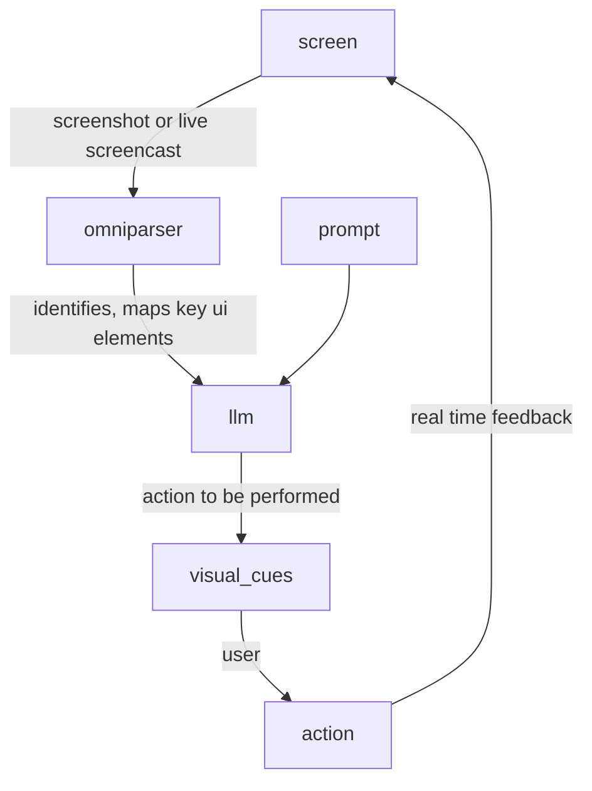
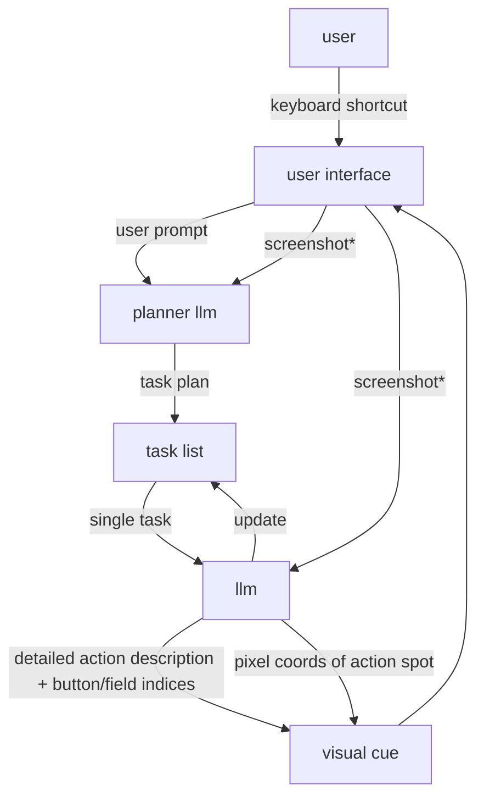
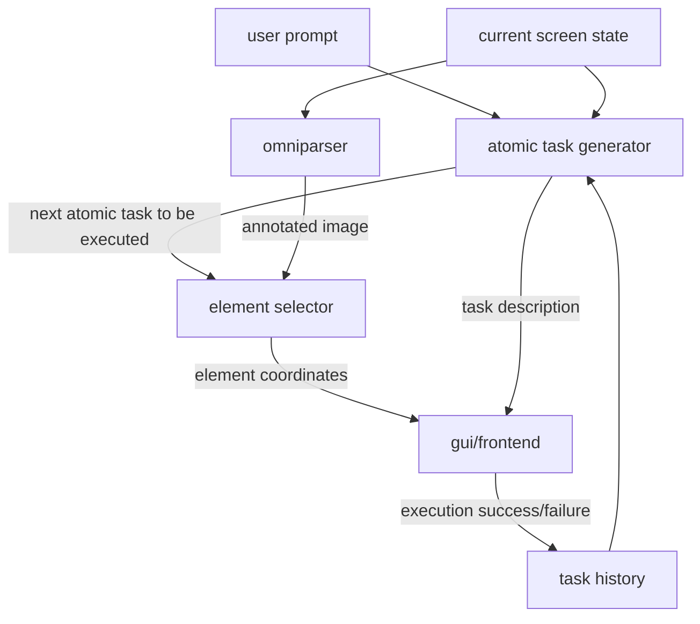

# bubble

for the gemma 3n hackathon by google deepmind, i intend on making a local ai based screen overlay helper that allows people to call it to command wherever and whenever they face an issue in their day to day tasks. 

the vision is pretty similar to google’s gemini live screen streaming, but with an added layer of ui - a screen overlay that displays the key troubleshooting steps/guide along with proper highlighting of the important elements to be accessed in the process.

what this possibly could look like is people in photoshop, autocad or matlab, being stuck with finding a particular feature, unable to move ahead. now, instead of laboriously looking for a solution across google, youtube, stack-exchanges and chatgpt, they access our tool via a shortcut, describe their issue in natural language and get the requisite solution along with visual and auditory cues.

this could further transition into the opportunity of integrating this with core apps such as the ones aforementioned and provide real time assistants (this could be a business opportunity right here).

---

[8 july 2025][1701 hrs]

i need to firstly analyse how agents work. 

as of now, i have come up with the following pipeline:



however, what is not clear is how the action and feedback loop works, what exactly the llm outputs when asked the prompt — whether it gives the entire process’ task list (improbable) or gives the first step(s) which is(are) most likely to be correct and once that’s done with, reanalyses the screen and then gives the next one(s). 

what i am thinking would be the best is having a list of broad steps to be outputted first, followed by detailed descriptions for each step one by one, being displayed after the previous one has been executed. 

i think creating an agent is easier than creating a guide as now, people have autonomy to do things, which means, one ill step and the ai gets confused and starts malfunctioning. 

ok let it be. i’ll study more about agents and then see where this goes.

---

[8 july 1800 hrs]

- [x]  check out browser-use
- [x]  check out warm wind
- [x]  check out omni parser


**^^warmwind**


**^^skyvern**

**some yt video:**

[https://colab.research.google.com/drive/1GV4VzhfI8l2uEBm2H9hQ2fs12_iFiYlQ?usp=sharing#scrollTo=x1Edd6dsflaa](https://colab.research.google.com/drive/1GV4VzhfI8l2uEBm2H9hQ2fs12_iFiYlQ?usp=sharing#scrollTo=x1Edd6dsflaa), [https://www.youtube.com/watch?v=Qnp4PQTE1Ag](https://www.youtube.com/watch?v=Qnp4PQTE1Ag)

**os atlas:**

also a library like omniparser, but this returns the pixel coords of the gui element.

[https://github.com/OS-Copilot/OS-Atlas](https://github.com/OS-Copilot/OS-Atlas)

**browser_use:**


---

[9 july 2025][1615 hrs]

i have tried to understand how different computer use agents work and have linked a few repos, screenshots and descriptions above of the ones i found useful.

the pipeline i had made above, wasnt very off. the area’s where it was off, were actually the areas i was confused in. so i’ll make the requisite changes, and let the hacking begin!



+feedback loop to be added

*screenshots pass through omniparser


^^ easier to understand. i still love pen an pencil over these plastic keycaps.

validator - success, inaction, failure. 

here’s a written version of what i have thought:

```markdown
1. the user calls the app using a shortcut, types their issue (prompt) on the interface
2. the app takes a screenshot, gives it to omniparser which annotates the image to index and tag interactive ui elements
3. the annotated screenshot and prompt goes to the planning llm (llm #1) which devises a list of tasks to be performed to achieve the goal. each tasks include 1 action at max. (for eg: for export to pdf the tasks are - go to file menu, go to export, choose pdf, save)
4. these tasks then go one by one to llm #2 along with a screenshot of the current state of the screen. the decides what action is to be done to complete the task (eg: for 'go to export' - click 'export' button) and also gives the coordinates of the button.
5. this description (click 'export' button) and coordinates is used to highlight the respective button and show it to the user.
6. the app waits for user action. once done, it moves forward to sending the next task to llm#2 and this continues till all the tasks are done
```

ok so for the first version, i’m gonna let cursor do it. i need to understand how these various libraries work and get an idea of how it will all play together. i know the code wont be neat and debugging would be a nightmare for me cuz i haven’t coded it out. but i think it’ll do well for starters, to make me understand the technicalities of it and then later i can code it out with my bare hands.

- vib(code)ing
    
    this is the task list cursor came up with after i gave my pipeline:
    
    - technical task list
        
        ### **1. Electron Overlay App**
        
        - [ ]  Set up Electron app with cross-platform build (Mac/Windows).
        - [ ]  Implement global keyboard shortcut listener.
        - [ ]  Create overlay UI for prompt input and step-by-step guidance.
        - [ ]  Implement overlay rendering for highlights and descriptions (transparent, click-through except for UI).
        - [ ]  Ensure overlay can be shown/hidden and does not interfere with normal app usage.
        
        ### **2. Screenshot Capture**
        
        - [ ]  Implement cross-platform screenshot capture (Node.js native modules or external tools).
        - [ ]  Ensure screenshot is of the correct display (multi-monitor support).
        
        ### **3. Omniparser Integration**
        
        - [ ]  Integrate with Omniparser (Python or API) to send screenshots and receive annotated UI elements.
        - [ ]  Parse and store Omniparser output for downstream use.
        
        ### **4. LLM #1: Task Planning**
        
        - [ ]  Integrate with Gemini API (or other LLM) for planning.
        - [ ]  Send prompt + annotated screenshot, receive ordered list of atomic tasks.
        - [ ]  Parse and store task list.
        
        ### **5. LLM #2: Action & Element Localization**
        
        - [ ]  For each task, send current screenshot + task to LLM #2.
        - [ ]  Receive action description and UI element coordinates.
        - [ ]  Parse and store action/coordinates.
        
        ### **6. Visual Guidance & User Interaction**
        
        - [ ]  Render highlight around UI element at given coordinates.
        - [ ]  Display action description in overlay.
        - [ ]  Track user actions (mouse clicks, keyboard events) to detect when the correct action is performed.
        - [ ]  Handle edge cases (user clicks wrong element, window focus changes, etc.).
        
        ### **7. Task Progression Logic**
        
        - [ ]  Manage task queue and progression.
        - [ ]  On correct user action, advance to next task.
        - [ ]  On completion, show success message and dismiss overlay.
        
        ### **8. Cross-Process Communication**
        
        - [ ]  Set up IPC (inter-process communication) between Electron (Node.js) and Python (Omniparser, LLM calls).
        - [ ]  Ensure robust error handling and fallback for communication failures.
        
        ### **9. Cross-Platform Packaging & Deployment**
        
        - [ ]  Package the app for Mac and Windows (Electron Builder, etc.).
        - [ ]  Bundle Python dependencies and ensure they run on both platforms (PyInstaller, virtualenv, etc.).
        - [ ]  Handle permissions (screen recording, accessibility APIs) for both OSes.
        
        ### **10. Configuration & Extensibility**
        
        - [ ]  Configurable keyboard shortcut.
        - [ ]  Modular architecture for swapping out LLMs or UI parsers.
        - [ ]  Logging and error reporting.
        
    
    ^^ looks pretty robust, i’ll let it start coding.
    
    ok this is f-ing my brains inside out. it feels like a blackbox, i dont understand a thing and the only thing i can do is plead like a begger to have cursor solve the errors. yet, despite the errors im gonna let it continue. so that i atleast know how its trying to integrate all of various things and then i’ll start myself.
    
    ok so the final thing isnt working due to a hell lot of errors, but here is a technical report i asked cursor to make, so my understanding about what it did in the mvp is bettered.
    
    [report - bubble_v2.pdf](bubble%202240ce9f6b8e8091897cc024a4eb2882/report_-_bubble_v2.pdf)
    

---

[11 july 2025][2222 hrs]

so, last 1.5 ish days, i have been learning js. and i think i have understood it’s basics well. on second thought, i shouldve have spent this much time, the real output has pretty much been 0, as i thought of it to be pretty similar apart from the basic syntax level differences. also, at this point i think, if you have a decent hold over one programming language, it shouldnt be hard to understand others and a more effecient way to go about it would be just to build a project and learn on the fly.

- [x]  im just gonna go through the basics of electron really quick, and then get started with coding.

ok, some basics covered, rest will be dealt with by referring to the documentation.

here’s a great github repo having a ton of boilerplates, tutorials and demo code:

[https://github.com/sindresorhus/awesome-electron](https://github.com/sindresorhus/awesome-electron)

this could be referred to for screenshots/sharing:

[https://github.com/hokein/electron-screen-recorder](https://github.com/hokein/electron-screen-recorder)

- [x]  next, i need to cover asyncio
- [ ]  and backend hosting

also then, i need to look into how cheating daddy works, majorly focusing on:

- [ ]  how are screenshots captured? is it a live stream (using gemini live) or screenshots when the prompt is asked
- [ ]  how do they make it resilient to screensharing

---

[13 july 2025][1800 hrs]

time to get my fingertips dirty, let the hacking begin!

- screenshot parsing
    
    i tried object detection via gemini as mentioned in their documentation but it didn’t work well. so i’ll just try setting up omniparser.
    
    for now, i’ll just run it off hf transformers, later i might set up an hf inference end point and call it via cloud.
    

---

[17 july 2025][1118 hrs]

i have pretty much wasted the last 3-4 days. need to lock in now.

- screenshot parsing
    
    i tried integrating omniparser but no luck. need to do the following, if it still doesn’t go through after this, then we skip to a different model.
    
    - [x]  ask claude for help
        
        ^gives the same old shit
        
    
    i’ve given omniparser a lot of time, but no avail. i even tried to run the entire code by cloning the repo but even that refused to work. so now, im looking to switch over to something else.
    
    - [x]  look into browser-use’s screenshot parsing mech
        
        ^^they use playwright which only works for browsers so cant be implemented
        
    
    ok nvm, omniparser worked. i was running into a variety of different module errors and despite multiple tries, i wasnt able to figure it out, but at the end, i prevailed.
    
    for now, it runs on gradio and o boy gradio is amazing. i can literally use the live link to run omniparser through any device while using my laptop for processing. also, i can use it as an api pretty easily.
    
    however, there are a few issues with this currently:
    
    1. the process takes a lot of time, 30 to 300 secs for images with less and more icons respectively. it isnt the detection algorithm that takes this much time but the caption model instead that takes up most of the time. the former takes less than a second.
        
        the model being used to generate captions is `florence2` or `blip2` which are vision language models, so ofc are bound to take time.
        
    2. i tried running it using the gradio api hosted on hf spaces by microsoft itself, which is returning the result quick, however i am not able to access the image being generated by it. this is what it returns `'/private/var/folders/60/wp6kd2cd13ddy3dqz4qcd6qw0000gn/T/gradio/2ecc912cae6e13ba7e6b6d0cea09619a0e3868b3c4d252fde589da5f58b5adfa/image.webp'` which means it’s just returning the local path on the server and not the image.
    
    it is imperative to solve these things, but later. for now, i’ll code rest of the app and then finally find a fix to the above, prolly by hosting it somewhere - [fly.io](http://fly.io) or hf spaces.
    

---

[20 jul 2025][1450 hrs]

i’ll start building the planner llm. just a regular gemini 2.5 flash call along with the screenshot being sent. 

i tested it out by sending a screenshot of the chatgpt interface without any annotations and gave this prompt `how do i start a new chat and upload a photo to it?` . here’s the response i got, pretty happy with it for now.


next, i ll work on making the second llm - the action selector. 

the prompt was `Click the '+' button next to the 'Ask anything' text input field.` and it correctly gave me the right icon to be selected.


next steps:

- [x]  create a screenshot capturer
- [x]  combine planner and action selector

one thing i’ve realised is that the captions being generated aren’t very precise and in fact making the action_selector select the wrong element. 
secondly the caption generation model is the reason for such slow responses. i am thinking to let it go, and my hypothesis is that the action_selector will only get more proficient in doing so. however, i do need to test this hypothesis.

ok, now how do i go about removing the captions? in the model i run locally, it is pretty easy since i can play with the code. however, since the model is being called using an api endpoint here, i can’t possibly change the code and neither do i see an option to disable captions being generated.
so maybe i’ll just deploy it locally and use it as an api (possible with gradio)

i have been able to remove the captioning and it takes way lesser than what it used to earlier, with only the annotation happening right now. however, the icon selection is still a little haywire.

before fixing that, i think a couple of other things need to be done:

- [x]  make the planner llm only give out broad descriptions not precise ones (exact button presses not needed)
- [x]  make the action selector llm decide the specifics of the atomic tasks to be performed

the above plan didnt work out, since one task of the planner’s plan can possibly contain multiple actions to be performed. so, i’ve added an atomic generator model that takes in tasks, one by one from the plan, and divides them into actions to be performed based on the screenshot input

so they new pipeline looks as follows


this is working way better.

next, i need to

- [x]  figure out a way to get the image returned as well
    
    ^^ for this, i changed the api’s output from returning a pil image to the base64 string of that image
    
- [x]  integrate the cue and automatic screenshots
    
    ^^ i have used the keystroke `ctrl+shift+0` to click a screenshot before every step be converted to atomic steps.
    
- [x]  create 2 versions:
    - [x]  one with the planner
    - [x]  one without the planner - only the atomic generator deciding what is to be done on the basis of current state, end goal and previous actions

i think the second version is bound to work better. currently the planner is working on foresight. it is predicting what must be done without having access to the current state. it just takes the initial state and decides the plan. in the case without the planner, the current step is only decided on the basis of the current state, the user intent and current history.
barring the foresight problem, there is also the issue of inefficiency. currently we are employing two models just to decide on the atomic tasks that need to be completed as opposed to one in case the planner is dropped.

hence, i feel its imperative to make the second version the main one.

---

the second version is up and running, and it works pretty damn well. way better than the first/planner one.

there are a few improvements yet to be made:

- [ ]  integrate a validator that verifies whether the previous action has been completed successfully or the user messed up
- [ ]  need to be very specific on which button to click in case of multiple buttons with the same label

i’ll do the above later. for now, i’ll focus on getting the frontend ready.

the frontend will be made using electron js, exact designs for which i havent figured yet.

https://www.electronjs.org/docs/latest

^^ keeping the documentation link here for easy access.

---

so i’ve been able to come up with a raw frontend. not the most aesthetically pleasing app, however, it suffices for the hackathon submission atleast.


however, there still are a few issues with this, which i need to fix:

- [x]  instead of image , upload base 64 upload to omniparser
- [x]  colors and aesthetics improve
- [x]  make sure bounding boxes are complete /neat and adjust the vertical alignment in the bounding box
- [ ]  bounding box moves /shifts if user scrolls in between. can we fix that -
A) make the process very fast
B) control the webpage (not relevant now)
- [x]  integrate a validator that verifies whether the previous action has been completed successfully or the user messed up
- [x]  need to be very specific on which button to click in case of multiple buttons with the same label
- [x]  giving the user flexibility to choose/fill, in case of forms.
- [x]  ctrl+shift+0 for next step ctrl+shift+1 for retry
- [ ]  improve latency
    - [ ]  change gemini calls also to base64
- [x]  remove the drop shadow at the center of the screen
- [x]  rename ‘processing’ messages
- [x]  disappearance on click
- [x]  clickthough not errorless
- [ ]  rephrase task descriptions
- [x]  completed message
- [x]  make it windows compatible
- [x]  doesnt enter typing mode on first open, fix that
- [x]  remove the settings button
- [x]  press crtl+shift+0 for next step
- [x]  fix history handling
- [x]  thinking box visible in screenshots
- [x]  remove ctrl+shift+f ctrl /
- [ ]  make click global
- [x]  description being cutoff
- [ ]  add glow to border
- [x]  fix ‘input focused’ wording and positioning
- [x]  task completed positioning - vertical and horizontal both
- [x]  scrolling
- [x]  instead of the bounding box, make the description box emerge from the place/button that needs to be interacted with, like a comment box.
- [x]  ctrl+shift+0 not working properly
- [ ]  vertical offset in windows
- [x]  entire pipeline should restart when task gets completed

pretty much ready for the submission. 

here is the final pipeline being used:



here are a few snapshots:


