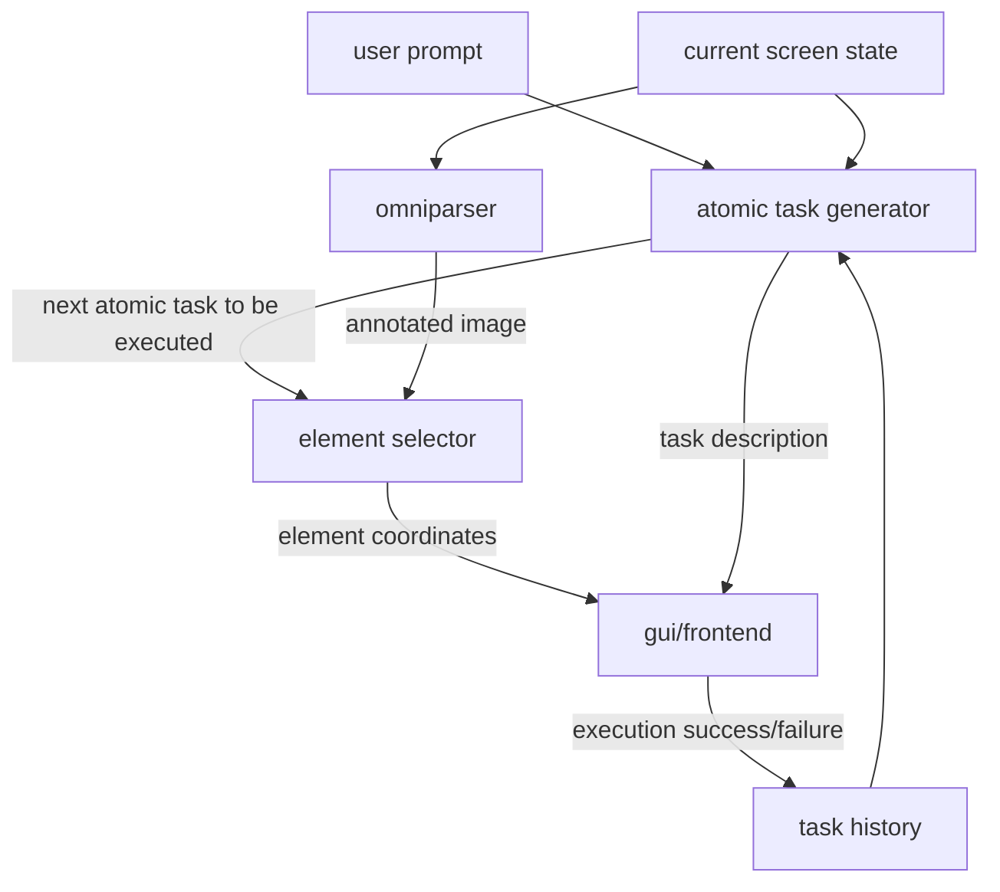

# Bubble: A Context-Aware Screen Assistant
## Technical Report for Gemma 3n Hackathon

## Table of Contents
1. [Introduction](#introduction)
2. [System Architecture](#system-architecture)
3. [Technical Implementation](#technical-implementation)
4. [Challenges and Solutions](#challenges-and-solutions)
5. [Engineering Decisions](#engineering-decisions)
6. [Future Improvements](#future-improvements)

## Introduction

Bubble is a screen overlay assistant that helps users navigate complex software interfaces by providing real-time, context-aware guidance. Unlike traditional help systems or chatbots, Bubble understands the current state of the user's screen and provides step-by-step visual guidance by highlighting relevant UI elements and explaining actions in natural language.

### Core Value Proposition
- **Context-Aware**: Understands the current state of the screen and user's progress
- **Visual Guidance**: Highlights relevant UI elements directly on screen
- **Step-by-Step Assistance**: Breaks down complex tasks into atomic actions
- **Natural Language Interface**: Users can describe their goals in plain English

## System Architecture

### High-Level Overview

The system follows a hybrid architecture combining Electron for the frontend and Python for the backend processing. Here's the final pipeline:



### Key Components

1. **Frontend (Electron)**
   - Transparent overlay window
   - Global shortcut management
   - Screen capture functionality
   - Visual feedback system
   - Inter-process communication

2. **Backend (Python)**
   - OmniParser for UI element detection
   - Atomic Task Generator (Gemma 3n)
   - Element Selector (Gemma 3n)
   - Task History Manager

3. **Communication Layer**
   - IPC between Electron and Python
   - Base64 image encoding for efficient transfer
   - JSON-based message protocol

## Technical Implementation

### Frontend Implementation

The frontend is built using Electron.js with several key features:

1. **Transparent Overlay**
```javascript
// Transparent window setup
new BrowserWindow({
    transparent: true,
    frame: false,
    fullscreen: true,
    webPreferences: {
        nodeIntegration: true,
        contextIsolation: false
    }
});
```

2. **Click-through Management**
```javascript
enableClickthrough() {
    this.clickthroughEnabled = true;
    document.body.classList.add('clickthrough-mode');
    this.overlayContainer.style.pointerEvents = 'none';
    this.fullscreenBorder.style.pointerEvents = 'none';
    this.promptContainer.style.pointerEvents = 'auto';
}
```

3. **Visual Feedback System**
```javascript
drawCommentBox(anchorX, anchorY, text) {
    // Dynamic positioning and scaling
    const boxWidth = Math.min(
        maxWidth,
        Math.max(...lines.map(line => ctx.measureText(line).width)) + padding * 2
    );
    // Speech bubble with tail pointing to UI element
    ctx.beginPath();
    // ... (complex path drawing)
}
```

### Backend Implementation

1. **Atomic Task Generator (Gemma 3n)**
```python
def generate_next_atomic_task(prompt, screenshot_path, history):
    # Context building
    context = {
        'user_intent': prompt,
        'current_state': process_screenshot(screenshot_path),
        'action_history': format_history(history)
    }
    
    # Gemma 3n call
    response = model.generate(
        context=build_prompt(context),
        temperature=0.2,
        max_tokens=150
    )
    
    return parse_atomic_task(response)
```

2. **Element Selector (Gemma 3n)**
```python
def select_element(screenshot, elements, action):
    # Element matching
    matches = []
    for element in elements:
        relevance_score = calculate_relevance(element, action)
        confidence_score = calculate_confidence(element)
        matches.append((element, relevance_score * confidence_score))
    
    return select_best_match(matches)
```

## Challenges and Solutions

1. **Cross-Platform Compatibility**
   - **Challenge**: Window decoration handling varied between macOS and Windows
   - **Solution**: Implemented content-aware bounds calculation
   ```javascript
   const contentBounds = this.windowContentBounds || this.windowBounds;
   const relX = absScreenX - contentBounds.x;
   const relY = absScreenY - contentBounds.y;
   ```

2. **UI Element Detection Performance**
   - **Challenge**: Initial OmniParser implementation was slow (30-300s)
   - **Solution**: Removed caption generation, focused on element detection
   - **Result**: Reduced processing time to <1s for most screens

3. **Task Planning vs. Reactive Approach**
   - **Challenge**: Initial planner-based approach was inflexible
   - **Solution**: Switched to reactive atomic task generation
   - **Benefits**: Better handling of dynamic UIs and user deviations

4. **Visual Guidance Accuracy**
   - **Challenge**: Ensuring accurate element highlighting across different screen sizes
   - **Solution**: Implemented DPI-aware scaling and content bounds correction

## Engineering Decisions

1. **Why Electron?**
   - Cross-platform compatibility
   - Native OS integration capabilities
   - Transparent overlay support
   - Rich ecosystem for screen capture and IPC

2. **Why Remove the Planner?**
   - Original planner worked on foresight without current state
   - Single model approach is more efficient
   - Reactive system handles dynamic UIs better
   - Reduced latency and complexity

3. **Base64 Image Transfer**
   - Efficient transfer between processes
   - Avoided file system operations
   - Consistent across platforms

4. **Comment Box Design**
   - Speech bubble design with tail pointing to elements
   - Ensures clear connection between instruction and target
   - Adaptive positioning to avoid screen edges

## Future Improvements

1. **Performance Optimizations**
   - Gemini API calls using base64
   - Caching for frequent UI patterns
   - Optimized screenshot capture

2. **Enhanced Validation**
   - Better success/failure detection
   - Form input validation
   - Scroll position tracking

3. **UI Improvements**
   - Global click handling
   - Improved Windows vertical offset
   - Enhanced border effects

The implementation demonstrates the practical application of Gemma 3n in creating a context-aware assistant that understands both user intent and UI state. The reactive approach, combined with visual guidance, provides a robust solution for helping users navigate complex interfaces.
